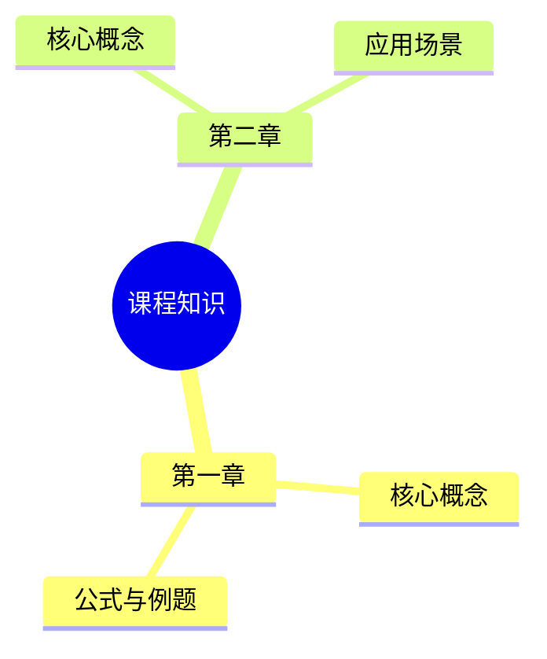

# Lecture to Knowledge Map

将课件、讲义和学习笔记转换为 **Mermaid 分层思维导图**与 **Obsidian 互链概念笔记**的 Codex skill，附 Codex 插件清单。

默认使用中文解释，保留英文关键概念。支持新建知识图谱、按指定大纲调整层级，以及将已有笔记拆分成互链笔记。

## 功能

- 按课程 → 章节 → 概念组织知识，保留案例、公式、假设和来源页码。
- 使用 Mermaid mindmap 表达层级，flowchart 表达顺序或决策逻辑。
- 生成总目录、章节与概念笔记，提供返回链接和相关概念链接。
- 拆分已有笔记前保留完整备份；将课程图示放在对应概念旁。
- 提供只读校验脚本，检查链接目标、目录可达性、返回链接与代码围栏。

## 安装为个人 skill

克隆仓库后，将 `skills/lecture-to-knowledge-map` 文件夹复制到 `~/.codex/skills/`。如果已有同名 skill，请先备份并比较内容，再决定是否替换。安装后在新任务中使用。

```sh
git clone https://github.com/yanglixian1106-design/lecture-to-knowledge-map.git
```

仓库根目录的 `.codex-plugin/plugin.json` 提供插件元数据，`skills/` 包含完整 skill。此仓库不包含 marketplace 配置。

## 使用示例

向 Codex 提供课件或笔记，然后输入：

> 使用 $lecture-to-knowledge-map，把这份课件整理为分层思维导图，保留来源页码。

> 按我提供的课程大纲调整知识层级，保留原有公式与案例。

> 将这份笔记拆分成 Obsidian 总目录、章节和概念笔记，保留原文件备份并校验链接。

只需要导图时，明确说明“只生成一份 Markdown 导图，不拆分笔记”。

## Obsidian 安装与使用教程

### 1. 安装 Obsidian

打开 [Obsidian 官方下载页](https://obsidian.md/download)，选择你的系统：

- **macOS**：下载 Mac 安装包，打开后将 Obsidian 拖入 Applications（应用程序）文件夹，再启动应用。
- **Windows**：下载 Windows 安装程序，双击并按提示安装，然后启动 Obsidian。
- **Linux**：选择适合系统的安装包，按[官方安装教程](https://obsidian.md/help/install)操作。

本项目的 skill 安装在 Codex 中，负责生成笔记；Obsidian 用来阅读、编辑和浏览生成的 Markdown 文件。无需将本仓库放入 Obsidian 的社区插件目录。

### 2. 创建或打开笔记库（Vault）

Vault 就是存放笔记的本地文件夹。首次打开 Obsidian 时，根据你的情况选择：

- **还没有笔记**：在 `Create new vault`（创建新仓库）旁点击 `Create`，输入名称（例如“课程笔记”），选择保存位置并创建。
- **已经有生成的笔记文件夹**：在 `Open folder as vault`（打开文件夹为仓库）旁点击 `Open`，选择完整的输出文件夹。

具体按钮名称可能随界面语言变化。参见[官方 Vault 教程](https://obsidian.md/help/vault)。

打开已有输出时，应选择生成笔记时使用的**链接根目录**，其中应包含总目录、概念笔记和图片附件。只打开 `notes/` 子文件夹可能导致跨目录链接失效。

### 3. 用本 skill 生成课程笔记

先完成上面的“安装为个人 skill”，再向 Codex 提供课件和实际保存位置。例如：

> 使用 $lecture-to-knowledge-map，把这份课件整理为 Obsidian 笔记。我的 Vault 路径是「填写实际路径」，请在其中的「统计学」文件夹里生成总目录、章节思维导图和概念笔记，保留来源页码、公式与课程图示，并校验链接。

下面是一种输出组织方式，实际文件名可按课程调整：

```text
课程笔记/                  ← 在 Obsidian 中打开这一层作为 Vault
└── 统计学/
    ├── index.md           ← 从总目录开始阅读
    ├── slides.pdf         ← 需要页码跳转时保留课件原文件
    ├── notes/
    │   ├── STAT-01 描述统计.md
    │   └── STAT-均值.md
    └── 图示/
        └── STAT-分布图-p12.png
```

如果先生成笔记、再放入已有 Vault，请告诉 Codex 目标 Vault 路径并调整链接。例如原来根目录下的 `[[notes/STAT-均值]]`，迁入 `统计学/` 后应改为 `[[统计学/notes/STAT-均值]]`。图片附件与课件也要一起迁移，迁移后重新校验。

### 4. 阅读导图、跳转概念和修改笔记

在 Obsidian 左侧文件列表打开课程的 `index.md`，从总目录进入章节和概念笔记。

- **阅读与编辑**：用 `Cmd+E`（macOS）或 `Ctrl+E`（Windows/Linux）切换阅读与编辑视图。阅读视图适合复习，编辑视图可补充自己的理解。参见[官方视图说明](https://obsidian.md/help/edit-and-read)。
- **概念链接**：点击笔记中的概念链接跳转，再通过“返回总目录”链接返回。要自己添加链接，在编辑器输入 `[[` 并选择目标笔记；如 `[[统计学/notes/STAT-均值|均值]]`。参见[内部链接说明](https://obsidian.md/help/links)。
- **思维导图**：生成笔记中的 Mermaid 代码块用于展示课程层级。Obsidian 内置 Mermaid 图表支持，先在阅读视图查看，无需为基本图表额外安装社区插件。参见[官方图表语法](https://obsidian.md/help/advanced-syntax)。

可以新建一份测试笔记，粘贴以下内容并切换到阅读视图，检查思维导图是否显示：

````markdown

````

Mermaid 图表达笔记内部的知识层级；概念之间的跳转使用正文中的链接。上述示例的图节点没有配置点击跳转。

### 5. 常见问题

| 遇到的情况 | 处理方法 |
| --- | --- |
| 导图显示为代码 | 先切换到阅读视图，检查代码块是否以三个反引号加 `mermaid` 开头、以三个反引号结束。 |
| Mermaid 报语法错误 | 保留错误信息，让 Codex 修复对应图表；不同 Obsidian 版本的 Mermaid 支持可能有差异。 |
| 点击概念后打开空白新笔记 | 先检查目标文件是否存在，以及打开的 Vault 根目录是否正确，再修正链接。 |
| 图片或课件打不开 | 检查附件是否一起保存、相对路径是否正确；移动文件夹后重新校验。 |
| 想继续补充或重组笔记 | 将当前笔记交给 Codex，说明要保留自己的修改；拆分前保留备份。 |

完成导入后，按下方“校验生成的笔记”运行脚本，再在 Obsidian 中实际打开总目录、概念链接和图示检查显示效果。

## 校验生成的笔记

需要 Python 3.9 或更高版本；脚本仅使用标准库。从仓库根目录运行：

```sh
python3 skills/lecture-to-knowledge-map/scripts/validate_notes.py \
  --root /path/to/vault \
  --index course/index.md \
  --notes-dir course/notes
```

纯拆分且需要保留原 Mermaid 图时，加上 `--before course/backup.md`。路径相对于 `--root`，也可使用绝对路径。

校验不覆盖标题锚点、Mermaid 语法与实际渲染、公式正确性或语义完整性。PDF/PPT 内容读取及图片渲染需要运行环境提供相应工具；本插件不捆绑 OCR 或 PDF/PPT 引擎。

## 文件结构

```text
.codex-plugin/plugin.json
skills/lecture-to-knowledge-map/
├── SKILL.md
├── agents/openai.yaml
├── references/obsidian-notes.md
└── scripts/validate_notes.py
```

本仓库仅包含可复用的 skill、参考规范和校验脚本，不包含课程资料或个人笔记。
